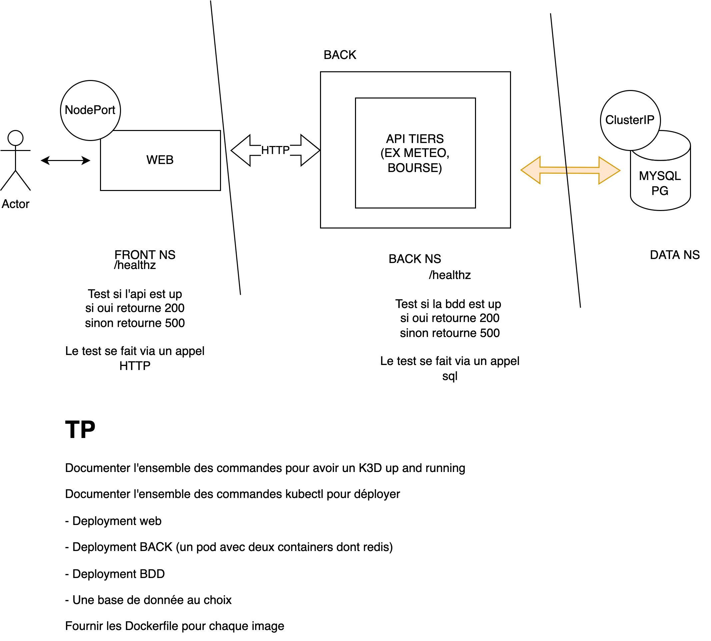

# Instructions



To show the connection between these different applications, I have chosen to create a simple web application that displays a greeting (`Hello world`) from the database.

The docker image is available on ghcr. To push it the following commands had to be executed :

# Push the docker image to ghcr

## login to ghcr

```bash
docker login ghcr.io -u USERNAME
```

## build image

```bash
cd web
docker build -t ghcr.io/do3-2023/mpa-kube/<web/api>:<version> .
```

## test image

```bash
docker run -itp 8080:8080 ghcr.io/do3-2023/mpa-kube/<web/api>:<version>
```

## Push on repo github

```bash
docker push ghcr.io/do3-2023/mpa-kube/<web/api>:<version>
```

# Install the necessary tools

## install k3d

To create a minimal kubernetes distribution locally on your machine, you can download (k3d)[https://k3d.io/v5.5.1/].

```sh
wget -q -O - https://raw.githubusercontent.com/k3d-io/k3d/main/install.sh | bash
curl -s https://raw.githubusercontent.com/k3d-io/k3d/main/install.sh | bash
```

## install kubectl

To gather all necessary information and interact with this cluster you will need the command line tool (`kubectl`)[https://kubernetes.io/docs/reference/kubectl/]

To install it, please follow the guidelines at (https://kubernetes.io/docs/tasks/tools/install-kubectl-linux/)[https://kubernetes.io/docs/tasks/tools/install-kubectl-linux/]


## create cluster

Once k3d installed, you will need to create a cluster :
```sh
k3d cluster create mpa-cluster
```

You can verify its creation by using kubectl :
```sh
kubectl cluster-info
```

# Deploy the application

Please place yourself at the root folder for the following commands.

## Deploy the database

```bash
kubectl apply -f database/infra
```

## Deploy the api

```
kubectl apply -f api/infra
```

## Deploy the web application

```
kubectl apply -f web/infra
```

# Access the application :

You will need to forward the listening port of the web application to access it on [localhost:8000](http://localhost:8000).
```bash
kubectl port-forward $(kubectl get pods -n mpa-frontend | tail -n 1 | cut -d ' ' -f 1) 8000:8000 -n mpa-frontend
```

The line `$(kubectl get pods -n mpa-frontend | tail -n 1 | cut -d ' ' -f 1)` simply gets the ip of the first (and in this case only) pod.


